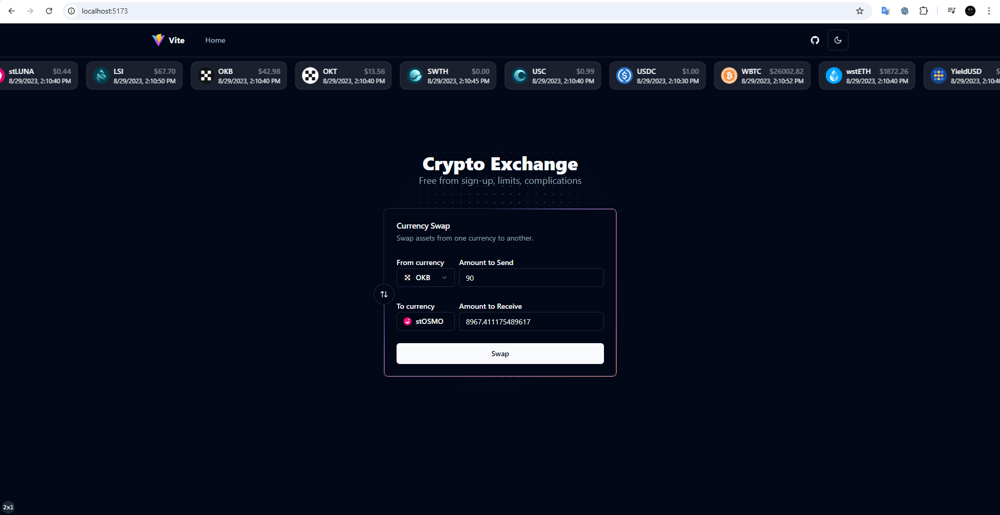

# Crypto currency swapper

## Demo online

- [https://code-challenge-mu-six.vercel.app](https://code-challenge-mu-six.vercel.app/)

- React + TypeScript + Vite + Shadcn + tailwind CSS
  

## Usage

### To install

```bash
yarn
```

### Run in development mode

```bash
yarn dev
```

## Features

- React + Typescript + Vite
- Radix UI Primitives
- Tailwind CSS
- Icons from [Lucide](https://lucide.dev)
- Dark mode
- Tailwind CSS class sorting, merging and linting.
